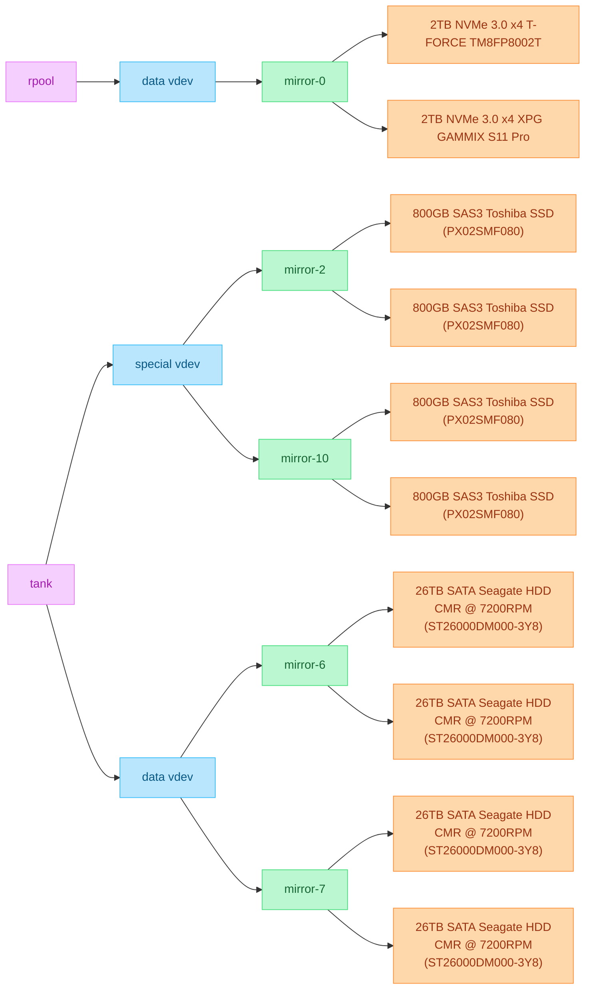
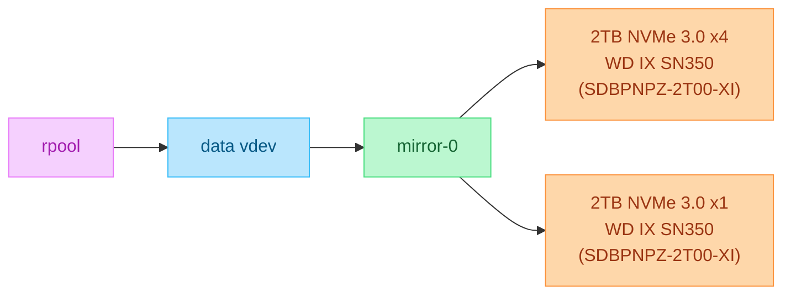

# Dante's Docker Stacks
## Machines

|                          Machine                          |            Model             | CPU                   | RAM            | OS      | Filesystem | Nomenclature                                                                    |
| :-------------------------------------------------------: | :--------------------------: | :-------------------- | :------------- | :------ | :--------- | :------------------------------------------------------------------------------ |
|                            Kex                            |   Lenovo ThinkStation P510   | Intel Xeon E5-1650 v4 | 256GB DDR4 ECC | Proxmox | ZFS        | "Biscuit" in Icelandic, since it has many pieces (containers)                   |
| [Hoppípolla](https://www.youtube.com/watch?v=JAYb8ZyjzD0) | Lenovo ThinkStation P340 SFF | Intel Xeon W-1250     | 64GB DDR4 ECC  | Proxmox | ZFS        | Named after the [Sigur Rós](https://en.wikipedia.org/wiki/Sigur_R%C3%B3s) song  |
|  [Marigold](https://www.youtube.com/watch?v=CdqQzIDBd_Y)  |         Beelink EQ14         | Intel N150            | 32GB DDR4      | Proxmox | ZFS        | Named after the [Ocean Blue](https://en.wikipedia.org/wiki/The_Ocean_Blue) song |

## Storage
### ZFS Pools
#### Kex

#### Hoppípolla

#### Marigold

