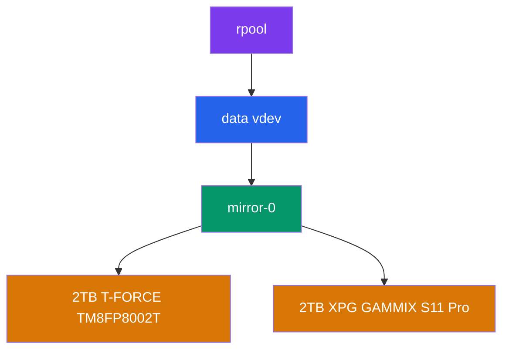
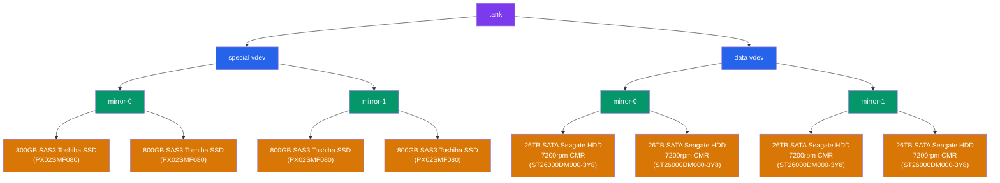
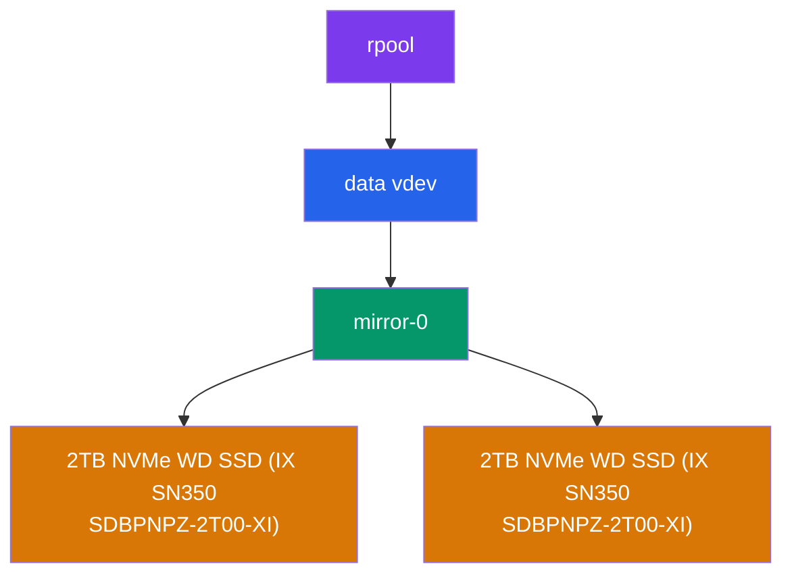

# Dante's Docker Stacks
## Machines

|                          Machine                          |            Model             |                  Specs                  |     OS     | Notes                                                                           |
| :-------------------------------------------------------: | :--------------------------: | :-------------------------------------: | :--------: | :------------------------------------------------------------------------------ |
|                            Kex                            |   Lenovo ThinkStation P510   | Xeon E5-1650 v4, 256GB DDR4 RDIMM (ECC) | Proxmox VE | "Biscuit" in Icelandic, since it has many pieces (containers)                   |
| [Hoppípolla](https://www.youtube.com/watch?v=JAYb8ZyjzD0) | Lenovo ThinkStation P340 SFF |   Xeon W-1250, 64GB DDR4 UDIMM (ECC)    | Proxmox VE | Named after the [Sigur Rós](https://en.wikipedia.org/wiki/Sigur_R%C3%B3s) song  |
|  [Marigold](https://www.youtube.com/watch?v=CdqQzIDBd_Y)  |         Beelink EQ14         |   Intel N150, 32GB DDR4 SODIMM (ECC)    | Proxmox VE | Named after the [Ocean Blue](https://en.wikipedia.org/wiki/The_Ocean_Blue) song |

## Storage
### ZFS Pools
#### Kex

#### Hoppípolla

#### Marigold

